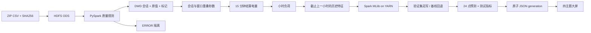

# 部署、演示与追溯

## 首次验证

1. 安装 README 锁定依赖；运行 `bigdata/scripts/run_sample.sh`。它从真实 ZIP 抽取三个不同站点及其会话/BMS，运行完整模型流程，结果放 `.bigdata/sample-dashboard/data`，不覆盖正式大屏。
2. 完整数据执行 `run_full_pipeline.sh`；已有输出也可按 `submit.sh <job>` 重跑阶段。固定一个 `RUN_ID` 用于串联所有阶段。
3. 集群模式设置 `SPARK_MASTER=yarn` 和 `cluster.yaml`。先确认 `yarn node -list` 至少一个 RUNNING 节点，HDFS 非安全模式；不得通过格式化已有集群排错。
4. 小组多用户采用独立 Hive Metastore，在配置添加 `hive_metastore_uri: thrift://host:9083`，执行 `create_tables` 登记 Parquet。单人可设 `enable_hive: true` 使用本地 Derby，但不能同时运行多个访问同一 Derby 的进程。

## 十分钟现场演示

- **运营总览**：指明模拟数据与截止日期，展示日结算电量、收入、活跃用户和行政区负荷。导航地图沿用项目原页面；47 站无经纬度，不把地图旧点位当作数据集精确点位。
- **AI 负荷预测**：选两个站点，切换 1/6/24 小时，确认总电量、曲线、表格和建议同步。解释 GBT 或基线为何被发布；查看测试 MAE 和相对基线改善，负改善也会保留。
- **用户需求**：展示 168 时段热力图、群体电量分布、真实留出评估。说明用户均值三级回退，新用户不能被伪装成个性化预测。
- **数据与模型健康**：找到 3,319 条容量冲突、恒零累计量及负电流业务约定。查看 HDFS 路径、任务 Application ID 与模型版本。
- **Hadoop UI**：NameNode `http://localhost:9870`，YARN `http://localhost:8088`。在 YARN 应用页展示成功训练的 application。伪分布式只有一个 DataNode，并不是三节点压力验收。

## 任一站点的血缘

具体查看 `models/load/station_id=1001/production.json` 的 `version`，进入同版本目录找到 `manifest.json` 和 `metrics.json`。特征版本指向 `features/load/version=...`；按站点和小时查看 DWS，再按会话时间追溯 DWD。逐会话与全量守恒摘要在 `audit/<run_id>/energy_conservation.json`。

## 失败恢复

- Schema 缺列停止导入；修复输入后用新摄取日期重试，不覆盖 ODS。
- 同一阶段覆盖写入幂等；失败后重跑该阶段及下游。原始源和隔离证据保留。
- 分站拟合失败记录错误并评估全局与基线；如果历史不足或验证窗口为空则停止发布，不能导出缺站结果。
- Web 刷新错误保留已加载结果；流水线失败不更新 current 指针。`latest-attempt.json` 提示最近失败。正式 JSON 文件不要手工填指标。
- `code/web/data/runs` 可以在确认没有读者引用后人工归档；本实现不自动删除历史发布。

## 当前工程边界

- 核心验证使用 47 站、619 天的模拟数据，不能作为真实场景预测能力背书。
- HDFS/YARN 单节点是集群接口验证；三节点网络、权限和容量规划需在实际小组集群另验。
- 日常增量当前可用全量幂等重算实现；分区依赖驱动的增量执行、外生预报可用性、直接 6/24 小时校准模型、P2 功能仍是扩展项。
- 当前三个时间回测块复用训练期模型，不能称为三次扩展训练集重训。
